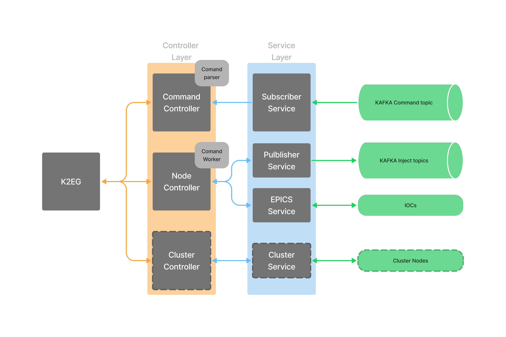

# Kafka to Epics Gateway
Author: Claudio Bisegni

Company: SLAC National Accelerator Laboratory

[](https://github.com/slaclab/k2eg/actions/workflows/build.yml)
[](https://github.com/slaclab/k2eg/actions/workflows/codeql.yml)
[](https://github.com/slaclab/k2eg/actions/workflows/build-docker-image.yml)
## Description
A c++ implementation of a two way gateway from kafka and [EPICS](https://epics.anl.gov) Control System, that aim to be a central processing unit for specific daq needs for high level alghoritms.

It reveice command from a specific kafka's topic and permit to inject EPICS  data torwards other topics.

## Implementation Status
Actual implementation receive command and interpret command and uses only JSON serializaiton (described later). It's lack of cluster management and other advanced feature

```[tasklist]
### Command Task List
- [x] Get Command
- [x] Monitor Command
- [X] Put Command
    - Scalar
    - ScalarArray
- [ ] Info Command

### Functional Task List
- [x] JSON Serialization
- [X] MSGPack Binary serialization
- [X] MSGPack compact serialization
- [ ] Cluster implementation
- [ ] Multithreading EPICS Monitor
```
For the serialization and message format see documentation [here](doc/message-format.md)
## Application Architecture
<p>The application architecture logic is designed following the scheme below. The dotted line boxes represent element not yet developed.</p>
<p>
There are two principal layer:

* Controller:
    * Node Controller
    * Command Controller
    * Cluster Controller (to design)
* Service:
    * Publisher and Subscriber:
    * Data storage
    * Log
    * EPICS
    * Cluster Services (to design)
</p>



## Getting started
This project aim to realize an [EPICS](https://epics.anl.gov) gateway for interact with epics IOCs using kafka. It uses a input topic from a kafka cluster for receive json encoded commands that permit to execute IO operation on the IOCs.

## Parameter
k2eg rely upon boost program options to manage the startup option configuration. Below the complete list of the parameter:

```console
k2eg --help
Epics k2eg:
  --help                                Produce help information
  --conf-file arg (=0)                  Specify if we need to load 
                                        configuration from file
  --conf-file-name arg                  Specify the configuration file
  --log-level arg (=info)               Specify the log level[error, info, 
                                        debug, fatal]
  --log-on-console                      Specify when the logger print in 
                                        console
  --log-on-file                         Specify when the logger print in file
  --log-file-name arg                   Specify the log file path
  --log-file-max-size arg (=1)          Specify the maximum log file size in 
                                        mbyte
  --log-on-syslog                       Specify when the logger print in syslog
                                        server
  --syslog-server arg                   Specify syslog hotsname
  --syslog-port arg (=514)              Specify syslog server port
  --cmd-input-topic arg                 Specify the messages bus queue where 
                                        the k2eg receive the configuration 
                                        command
  --cmd-max-fecth-element arg (=10)     The max number of command fetched per 
                                        consume operation
  --cmd-max-fecth-time-out arg (=100)   Specify the timeout for waith the 
                                        command in microseconds
  --pub-server-address arg              Publisher server address
  --pub-impl-kv arg                     The key:value list for publisher 
                                        implementation driver
  --sub-server-address arg              Subscriber server address
  --sub-group-id arg (=k2eg-default-group)
                                        Subscriber group id
  --sub-impl-kv arg                     The key:value list for subscriber 
                                        implementation driver
  --storage-path arg (=/workspace/k2eg.sqlite)
                                        The path where the storage files are 
                                        saved
  --metric-enable arg (=0)              Enable metric management
  --metric-server-http-port arg (=8080) The port used for publish the http 
                                        metric server 
```

There are two ohter different way to configure the application other to the common command line option and are:
* [configuration file](#configuration-file)
* [environment variable](#environment-variable)

### Configuration File
The uses of the configuration file is activated using the command line option:
```console
k2eg --conf-file --conf-file-name <path/to/configuration/file>
```
the content of the file need to folow the rules:
```conf
...
log-file-max-size=1234
log-on-syslog=true
syslog-server=syslog-server
syslog-port=5678
sub-server-address=sub-address
sub-group-id=sub-group-id
...
```

### Environment variable
The uses of the environment variable si automatically managed, each variable with the prefix *EPICS_k2eg_* is valuated, for example the enable to use the config file can be done via ENV variable with:
``` console
export EPICS_k2eg_conf-file
export EPICS_k2eg_conf-file-name=<path/to/configuration/file>
```

## Commands

### Get Command
This implemets the base caget|pvaget fucntion of epics command, if possible will use a client from a monitor thread, otherwhise a new client is allcoated to perform a get operation. The ***reply_id*** field is nto mandatory and it is forwarded, into the reply message.
```json
{
    "command": "get",
    "serialization": "json|msgpack",
    "protocol": "pva|ca",
    "pv_name": "channel::a",
    "reply_topic": "reply-destination-topic",
    "reply_id": "reply id"
}
```

### Monitor Command
This implements the base camonitor|pvamonitor function of epics client, create a monitor thread into the gateway that send over the destination topic the received values. The field **monitor_destination_topic** shuld be used to specify the monitor event topic, if not speified the event will be forwarded to the reply topic.

Monitor Activation
```json
{
    "command": "monitor",
    "serialization": "json|msgpack",
    "protocol": "pva|ca",
    "pv_name": "pv name",
    "reply_topic": "reply-destination-topic",
    "reply_id":"reply id",
    "activate": true,
    "monitor_destination_topic":"alternate-destination-topic"
}
```

Monitor deactivation
```json
{
    "command": "monitor",
    "pv_name": "pv name",
    "reply_topic": "reply-destination-topic",
    "reply_id":"reply id",
    "activate": false,
    "monitor_destination_topic":"alternate-destination-topic"
}
```
### Put command
Put comamdn permit to change the value field of a PV. The value need to be string that will be automatically converted to the type of the
PV. The put command can send a reply with the result of the put operation, in this case the ***dest_topic*** field si mandatory and the ***reply_id*** field is nto mandatory and it is forwarded, into the reply message.
```json
{
    "command": "monitor",
    "pv_name": "pv name",
    "protocol": "pva|ca",
    "value": "pv new value",
    "reply_topic": "reply-destination-topic",
    "reply_id":"reply id"
}
```